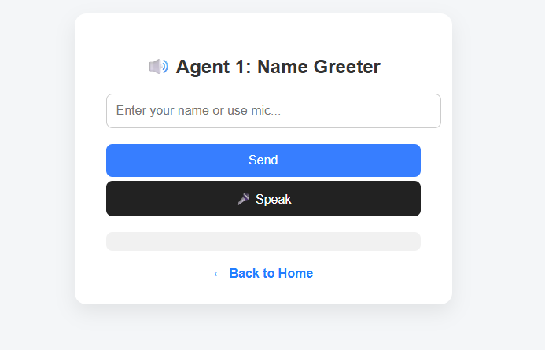
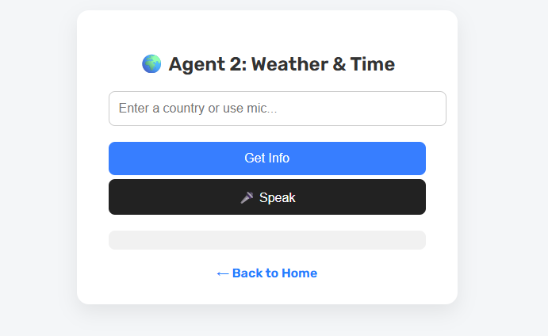

# Hazem AI Agents

A simple, interactive web app featuring two AI-powered agents:

- **Agent 1:** Greets users by name, with basic language detection (supports Arabic and English greetings).
- **Agent 2:** Provides current weather and time for any country (no API key required).

---

## Demo

> **Note:** Place your screenshots in the `screenshots/` folder in the project root.

### Home Screen


### Agent 1: Name Greeter


### Agent 2: Weather & Time


---

## Features

- Modern, responsive UI (HTML/CSS/JS)
- Voice input support (speech recognition)
- Text-to-speech responses
- No authentication or API keys required
- Lightweight Flask backend

---

## Getting Started

### Prerequisites
- Python 3.7+
- pip

### Installation
1. Clone the repository:
   ```bash
   git clone <repo-url>
   cd AI
   ```
2. Install dependencies:
   ```bash
   pip install flask requests pytz iso3166
   ```

### Running the App
```bash
python app.py
```
Visit [http://localhost:5000](http://localhost:5000) in your browser.

---

## Usage

### Home Page
- Choose between Agent 1 (Greet by Name) and Agent 2 (Weather & Time).

### Agent 1: Greet by Name
- Enter your name (supports Arabic and English).
- Or use the microphone button for voice input.
- The agent greets you in the detected language.

### Agent 2: Weather & Time
- Enter a country name (e.g., France, Egypt).
- Or use the microphone button for voice input.
- The agent responds with the current weather and time for that country.

---

## Project Structure

```
AI/
  app.py                # Flask backend
  static/styles.css     # CSS styles
  templates/
    home.html           # Home page
    agent1.html         # Agent 1 UI
    agent2.html         # Agent 2 UI
  screenshots/          # Screenshots for README
```

---

## API Endpoints

- `POST /api/agent1`  
  Request: `{ "name": "Your Name" }`  
  Response: `{ "response": "Hey Your Name!" }` (or Arabic greeting)

- `POST /api/agent2`  
  Request: `{ "country": "Country Name" }`  
  Response: `{ "response": "Weather info. Current time: ..." }`

---

## Technical Details

- **Flask** serves the backend and API endpoints.
- **wttr.in** is used for weather data (no API key needed).
- **pytz** and **iso3166** are used for timezone and country code lookup.
- **SpeechRecognition** and **SpeechSynthesis** (browser APIs) enable voice input/output.

---

## License
MIT (or specify your license)

---

## Author
Hazem 